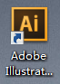

# Text-Images-align
多文字多图片垂直居中法

#### 多行文本垂直居中法
利用`display:table-cell+vertical-align:middle;+height`实现多行文本垂直居中
（ps:设置`height`和`text-align:center`还可以设置水平居中）
````
html..
<div class="unKownLineBox">
    <span class="unKownLine-text">
            第一行文字
        <br>第二行文字
        <br>第二行文字
    </span>
</div>

css..

  .unKownLineBox {
         width: 300px;/*!这是重点*/
         height: 200px; /*!这是重点*/
         display: table-cell; /*!这是重点*/
         vertical-align: middle; /*!这是重点*/
         border: 3px solid #5f9aff;
         font-size: 14px;
         padding: 0 10px;
     }

     .unKownLine-text {
         display: inline-block;
         vertical-align: middle;
     }
````

#### 多图片垂直居中法
````
html...
<div class="moreImgBox-1">
    <a class="moreImgItem-1"></a>
    <a class="moreImgItem-1"></a>
    <a class="moreImgItem-1"></a>
</div>

css...

 .moreImgBox-1 {
        margin: 10px 0;
        display: inline-block; /*!这是重点*/
        font-size: 33px; /*!这是重点*/
        vertical-align: middle; /*!这是重点*/
        text-align: center;
        border: 2px solid #5f9aff;
        padding: 10px;
     }
    .moreImgBox-1 a{
        display:inline-block
    }
    .moreImgBox-1 a img {
        vertical-align: middle;
        border: 1px solid #00C1B3;
        padding: 2px;
    }

````
#### 单图片垂直居中方法
````
html..
<div class="singleImgBox-1">
    <a></a>
</div>

<div class="singleImgBox-2">
    
</div>

css..

     .singleImgBox-1 {
            width: 300px;
            height: 300px;
            background-color: #beceeb;
            font-size: 0;
            *font-size: 200px;
            text-align: center;
        }

        .singleImgBox-1 a img {
            vertical-align: middle;
        }

        .singleImgBox-1:after {  /*!这两段是重点*/
            display: inline-block;
            width: 0;
            height: 100%;
            content: "center";
            vertical-align: middle;
            overflow: hidden;
        }

        .singleImgBox-2 {
            position: relative;/*!这两段是重点*/
            display: block;
            width: 300px;/*!这两段是重点*/
            height: 300px;/*!这两段是重点*/
            background-color: #5f9aff;
        }

        .singleImgBox-2 img {
            position: absolute;/*!这两段是重点*/
            top: 0;  left: 0;  right: 0;  bottom: 0;
            margin: auto;/*!这两段是重点*/
        }

````
#### 文字和图片垂直居中方法
````
html..
<div class="textImgBox-1">
    <span>text</span>
    
</div>
css
 .textImgBox-1 span, .textImgBox-1 img {
            vertical-align: middle;/*!这两段是重点*/
        }

````

#### 常见input表单布局流

思路：
* 文字标题用绝对定位
* 右边内容用`margin-left`来设置距左边的宽度
* 提示语也用绝对定位，但是相对于`content`来定位
优点：

* 解决常见input布局流的提示语打乱布局的问题
* 解决提交按钮没有标题需要单独写一个空标题容器的问题
* 可以定制化提示语的相对于输入框的垂直位置(改`.tip-msg`的`top`为`bottom`)
缺点：
* 解决不了提示语自适应跟随输入框后面出现的问题，需要手动设置提示语的left和top属性
* 实现不了提示语自适应浮动换行

（ps:缺点都可以用js解决，获取input的宽度，设置提示语的位置为input宽度+10px，在js执行时是调用即可，同时计算li宽度和input宽度和提示语宽度之和，判断两者的大小，li宽度小于和的宽度，就将position设置为static）
<br/>
html
``````

    <ul class="layout-ul">
        <li>
            <div class="title">input标题</div>
            <div class="content">
                <input type="text"/>
                <div class="tip-msg">tip-message</div>
            </div>
            <div class="content">
                <textarea name="textarea"></textarea>
                <div class="tip-msg">tip-message</div>
            </div>

        </li>
        <li>
            <div class="title">input标题</div>
            <div class="content">
                <input type="text"/>
                <div class="tip-msg">tip-message</div>
            </div>
            <div class="content">
                <textarea name="textarea" ></textarea>
                <div class="tip-msg">tip-message</div>
            </div>

        </li>
        <li>
            <div class="content">
               <button class="btn">提交</button>
               <button class="btn">提交</button>
               <button class="btn">提交</button>
            </div>
        </li>
    </ul>
``````

CSS
````
    .layout-ul{
            width: 100%;
            overflow: auto;/*去除浮动*/
        }
        .layout-ul li{
            position: relative;
            float: left;
            width: 50%;
            list-style: none;
            height: auto;

        }
        .layout-ul .title{
            display: inline-block;
            position:absolute;
            top: 0;
            left: 0;
            width: 120px;
            text-align: right;

        }
        .layout-ul .content{
            display: block;
            margin-left: 120px;
            padding-left: 10px;
            position: relative;
            margin-top: 15px;
        }
        .layout-ul .content textarea{
            height: 200px;
            width: 167px;
        }
        .layout-ul .tip-msg{
            position: absolute;
            top: 0px;
            /*bottom:0px;/!*改top为bottom,则文字就跟输入框底部对齐*!/*/
            left: 190px;
            white-space: nowrap;/*防止文字换行*/
        }
````